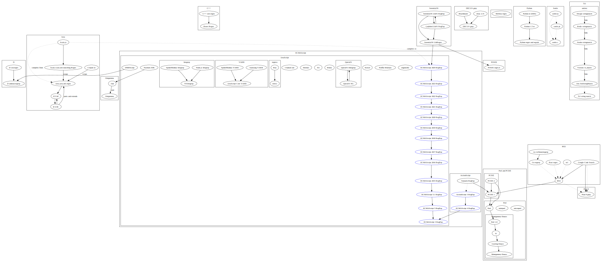

# Regular Expression Museum

A museum of historical and modern regular expression engines, showing their
development and influence. It is early in development and information is
currently organized as research notes, not yet polished for presentation.

Engines are grouped into categories and listed in the [index](index.md):

- [Educational](edu/index.md)
- [grep utilities](greps/index.md)
- [Libraries](libs/index.md)
- [Papers](papers/index.md)
- [Programming languages](langs/index.md)
- [Text editors](editors/index.md)
- [Viewers](viewers/index.md)

Some [people](people/index.md) who were influential to regular expressions have
additional pages.

Relations between regular expression engines, as a graph (very incomplete):

## License

Licensed under the terms of the GNU Free Documentation License, version 1.3.
