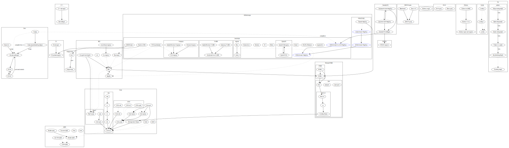

# Regular Expression Museum

A museum of historical and modern regular expression engines, showing their
development and influence.

Engines are grouped into categories or listed in the [index](index.md).

- [Educational](edu/index.md)
- [grep utilities](greps/index.md)
- [Libraries](libs/index.md)
- [Papers](papers/index.md)
- [Programming languages](langs/index.md)
- [Text editors](editors/index.md)
- [Viewers](viewers/index.md)

## License

Licensed under the terms of the GNU Free Documentation License, version 1.3.
